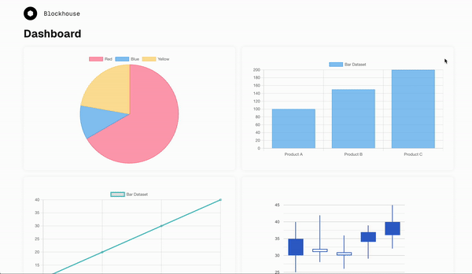
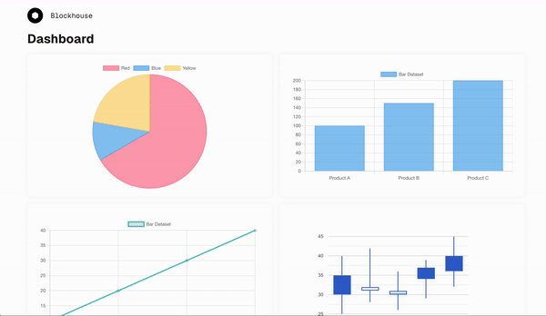
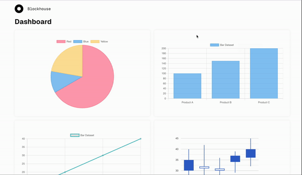

# Blockhouse Assessment

## Getting Started
The Django backend and Node.js frontend have been containerized with Docker. To start the app run the following commands from the root directory:
1. `docker-compose build`
2. `docker-compose up`

You can now visit [localhost:3000](http:://localhost:3000) to view the running app which is connected to the local backend server running inside the container.

## Technologies Used
- Next.js
- TypeScript
- Chart.js
- React Google Charts
- Django

## Approach and Thought Process
As the Django backend returns hardcoded data, the implementation was relatively simple. I used the djangorestframework to create REST APIs for the client. The endpoints simply serialize the data using the custom serializers and return the response.

On the client side, I decided to use the Next.js app router as it is the latest approach and the one recommended, and it also enables easy SSR. I decided to use SSR to minimize the computation load and network requests on the client side. In terms of project structure, since the app is a single page, I just used the root index/route page as creating a separate route would have been overkill for the requirement. To support the growth of the app, I extracted shared components into their own folder. While these components are only used by the dashboard, it is likely charts would be required in other pages and this allows easy reusal. I also created a simple utility folder containing constants and helper functions. This folder is global to the project but could be moved to a page/component level as the app grows. Finally, I decided to use CSS modules for styling to keep the JSX clean compared to Tailwind while also keeping the styling scopes clean.

## Demo
Overview

Responsive Design

Error Handling
